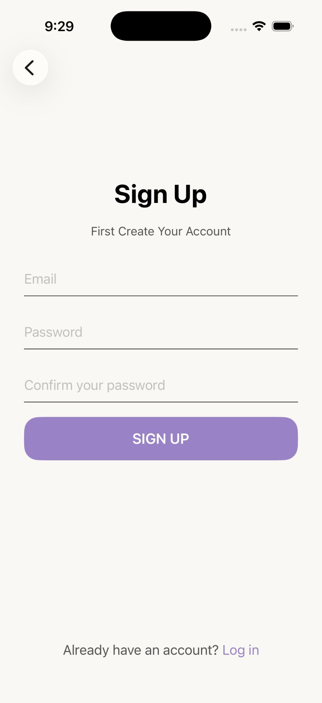
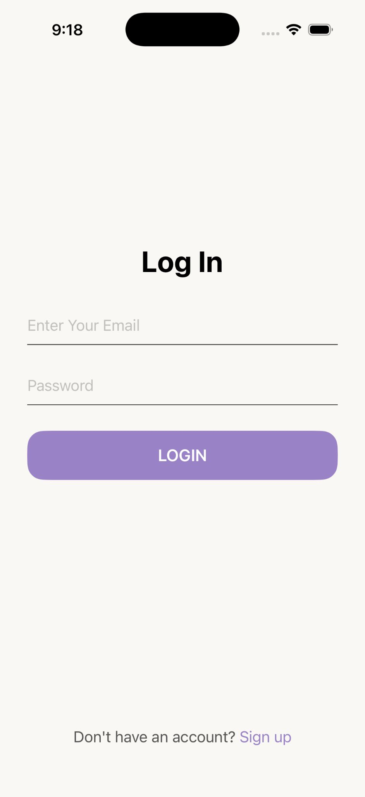
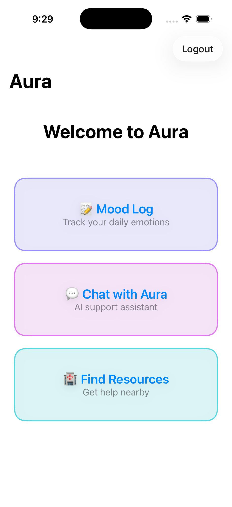
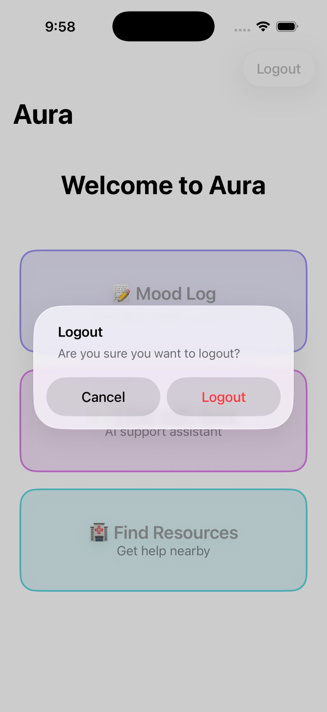
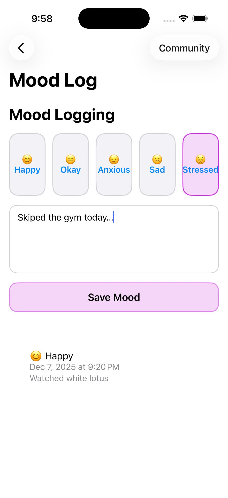
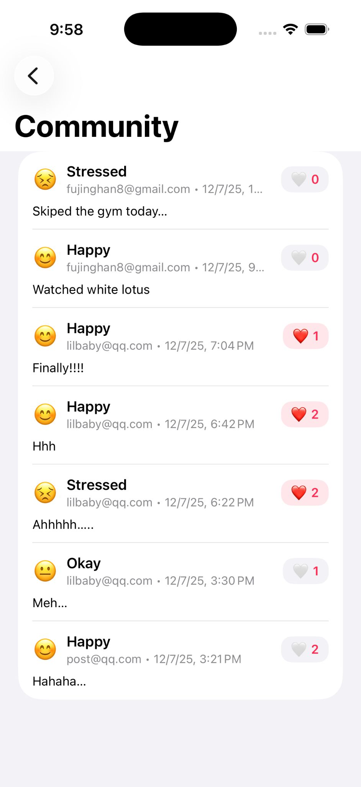
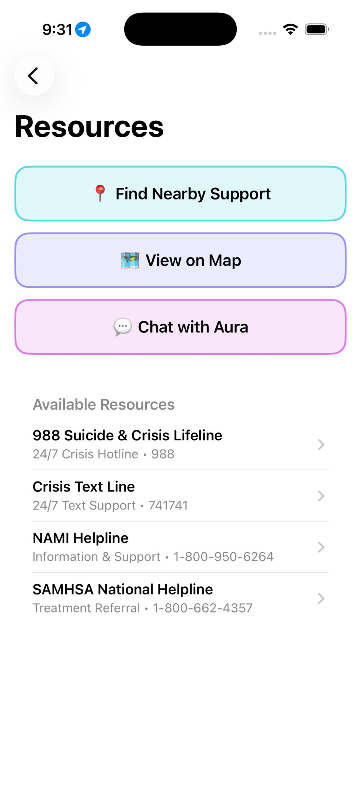

# Aura

Aura is an iOS app for logging moods, chatting with an AI assistant, and finding nearby mental health resources. It uses Firebase Auth/Firestore for login, mood storage, and a public community feed with likes, plus CoreLocation/MapKit for location-aware resources.

## Features
- **Auth**: Email/password sign up & login (Firebase Auth).
- **Home hub**: Quick entry to Mood Log, AI Chat, and Resources; logout with confirmation.
- **Mood Log**: Choose mood, add optional note, save to your private log and auto-publish to the community feed; view recent entries.
- **Community**: See everyone’s public mood posts and like/unlike them.
- **AI Chat**: Simple guided conversation with an assistant.
- **Resources**: View national hotlines, find nearby support using device/simulated location, open details in Apple Maps, and start navigation.

## Screens
- Sign Up / Login
- Home (Mood Log, Chat with Aura, Find Resources)
- Mood Log (with Community shortcut and likes on the public feed)
- Community feed
- AI Chat
- Resources list, Nearby Support, Map and navigation

## Project Setup
1) Requirements: Xcode 15+, iOS 17+ target, Swift, Swift Package Manager (Firebase via SPM), CoreLocation/MapKit enabled.
2) Firebase: app is configured via `GoogleService-Info.plist` (already included). Ensure Firebase project has Auth + Firestore enabled.
3) Open `Aura.xcodeproj` in Xcode. Dependencies resolve automatically via SPM.
4) Build & run on simulator or device. For Nearby Support, set a simulated location in the iOS Simulator (Features > Location) or allow location on device.

## Firestore Rules (community feed)
Make sure Firestore rules allow the public mood feed and likes (while keeping user data private). Example:
```
rules_version = '2';
service cloud.firestore {
  match /databases/{database}/documents {

    function isLikeCountChange() {
      return request.resource.data.diff(resource.data).changedKeys().hasOnly(['likeCount']) &&
             request.resource.data.likeCount is number &&
             request.resource.data.likeCount >= 0;
    }

    function isValidPost(data) {
      return data.keys().hasOnly(['authorId','authorName','mood','note','createdAt','likeCount']) &&
             data.mood is string &&
             data.createdAt is timestamp &&
             data.likeCount is int &&
             data.likeCount >= 0 &&
             (!data.note is string || data.note.size() <= 1000);
    }

    // Private user data
    match /users/{userId}/{document=**} {
      allow read, write: if request.auth != null && request.auth.uid == userId;
    }

    // Public moods + likes
    match /public_mood_logs/{postId} {
      allow read: if true;

      allow create: if request.auth != null
        && request.resource.data.authorId == request.auth.uid
        && isValidPost(request.resource.data);

      // Author can edit; any signed-in user can adjust likeCount
      allow update: if request.auth != null && (
        (request.auth.uid == resource.data.authorId && isValidPost(request.resource.data)) ||
        isLikeCountChange()
      );

      allow delete: if request.auth != null && request.auth.uid == resource.data.authorId;

      match /likes/{userId} {
        allow read: if true;
        allow create: if request.auth != null && request.auth.uid == userId;
        allow delete: if request.auth != null && request.auth.uid == userId;
        allow update: if false;
      }
    }
  }
}
```

## Usage Tips
- To test “Find Nearby Support” in the simulator, set a custom GPS location (e.g., Boston 42.3601, -71.0589).
- Community likes require sign-in and the above rules.
- AI Chat needs no location; the resources list works without location, while “Find Nearby Support / View on Map” needs location permission and navigation opens in Apple Maps.

## Screenshots

### Auth (Sign Up / Log In)
<div style="display:flex; flex-wrap:wrap; gap:12px;">
  
  
</div>

### Home hub
<div style="display:flex; flex-wrap:wrap; gap:12px;">
  
  
</div>

### Mood Log (private + publish to community)
<div style="display:flex; flex-wrap:wrap; gap:12px;">
  
</div>

### Community feed with likes
<div style="display:flex; flex-wrap:wrap; gap:12px;">
  
</div>

### AI Chat
<div style="display:flex; flex-wrap:wrap; gap:12px;">
  
</div>

### Resources (list / nearby / map / navigation)
<div style="display:flex; flex-wrap:wrap; gap:12px;">
  
  
  
  
  
  
  
</div>
